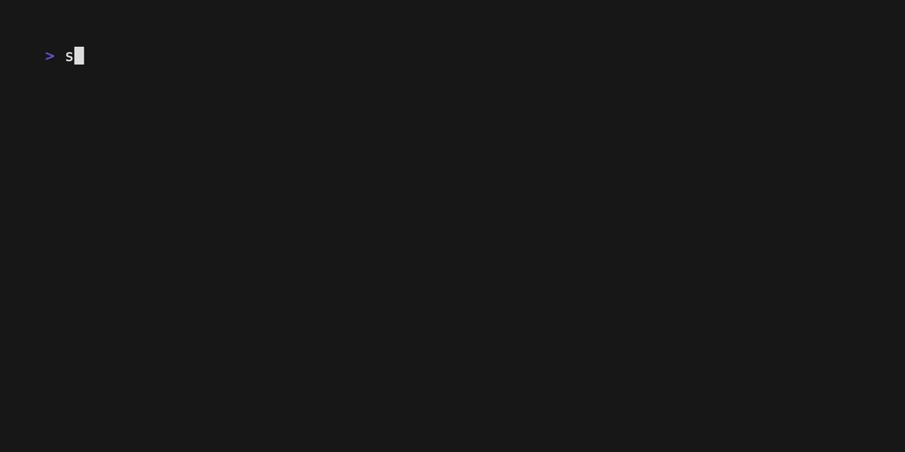

# files

This extension is based on the `files` example provided [in the sunbeam repo](https://github.com/pomdtr/sunbeam/tree/c1d479db4e83be553e015f1bdb372ad2c8bf85bc/docs/examples/file-browser)

It is modified to add the a visual cue (📦) whether an item is a folder or a file.

## Demo

